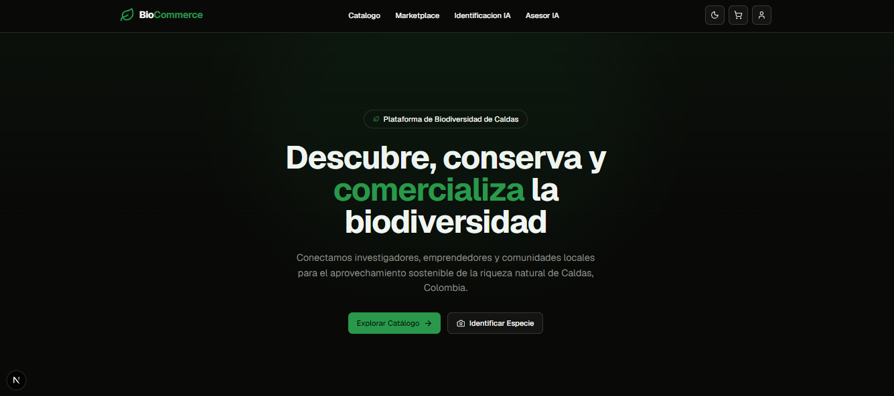
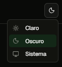
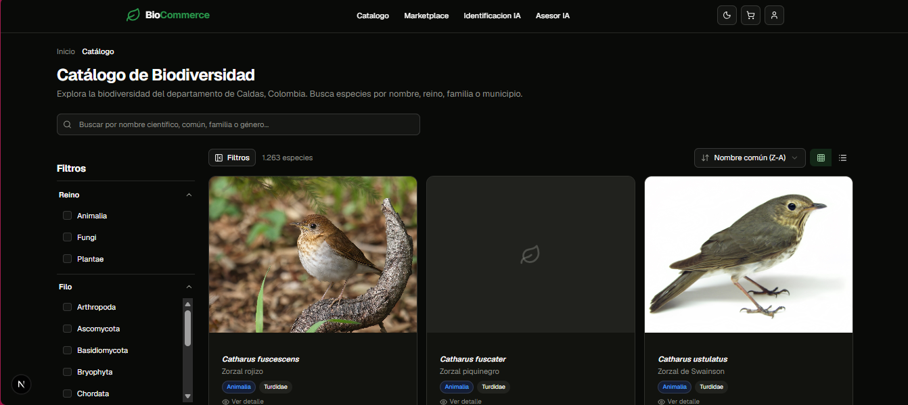
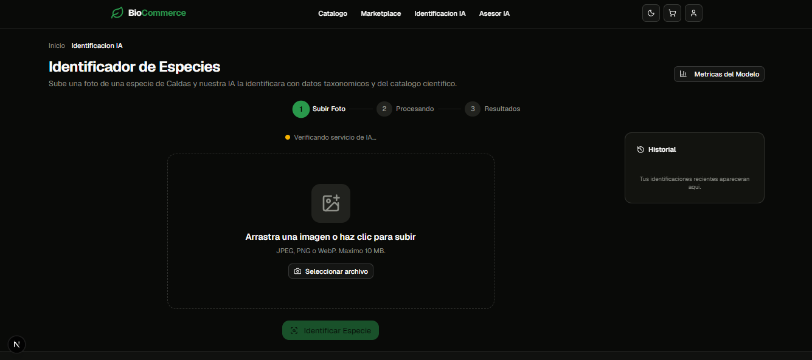
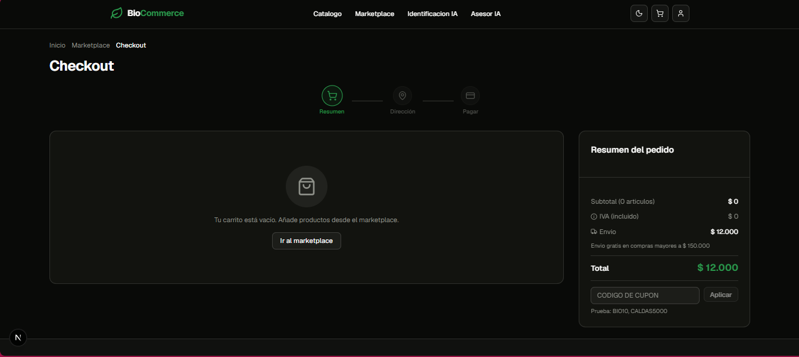
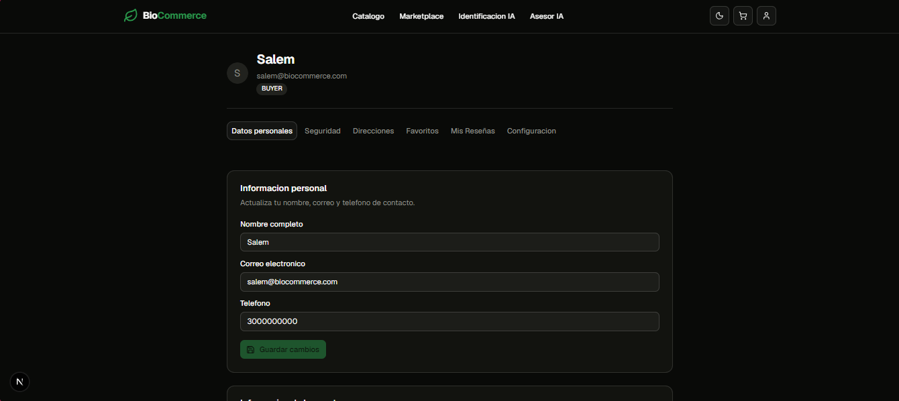

# Manual de Usuario - BioPlatform Caldas
## 1. Introducción

BioPlatform Caldas es una plataforma digital integral para la identificación, catalogación y aprovechamiento sostenible de la biodiversidad del departamento de Caldas, Colombia. Esta guía está diseñada para ayudar a los usuarios finales a navegar y utilizar eficazmente las funcionalidades principales de la plataforma.

## 2. Características Principales

### 2.1 Catálogo de Biodiversidad
- Acceso a información taxonómica y ecológica de flora, fauna y hongos de Caldas
- Búsqueda por nombre común, científico o características específicas
- Visualización de datos ecológicos, usos tradicionales y potencial económico

### 2.2 Identificación con IA
- Sistema de reconocimiento de especies mediante visión por computadora
- Precisión superior al 85% para más de 300+ especies registradas
- Funcionalidad disponible tanto en versión web como móvil

### 2.3 Marketplace de Biocomercio
- Conexión entre productores de ingredientes naturales, artesanías y ecoturismo con compradores
- Trazabilidad de origen y certificaciones de sostenibilidad
- Sistema de pagos integrado (PSE, tarjetas)

### 2.4 RAG & Chatbot
- Asistente de IA generativa para consultas especializadas
- Generación de planes de negocio de biocomercio
- Base de conocimiento con más de 1000+ especies

### 2.5 App Móvil
- Identificación de especies en campo con soporte offline
- Registro de avistamientos y contribución al catálogo

## 3. Primeros Pasos

### 3.1 Registro de Usuario
1. Acceder a la plataforma (http://localhost:3000 para desarrollo local)
2. Hacer clic en "Registrarse"
3. Completar el formulario con:
   - Nombre completo
   - Correo electrónico
   - Teléfono
   - Tipo de usuario (Investigador, Emprendedor, Comunidad, Comprador)
4. Verificar el correo electrónico mediante el enlace enviado
5. Completar el perfil de usuario

### 3.2 Inicio de Sesión
1. Acceder a la plataforma
2. Hacer clic en "Iniciar Sesión"
3. Ingresar correo electrónico y contraseña
4. Opcional: Autenticación de dos factores (si está habilitada)

### 3.3 Personalización de la Interfaz
La plataforma permite adaptar la visualización para una mayor comodidad. Puedes alternar entre el **Modo Claro** y el **Modo Oscuro** (iluminación) desde las opciones del sistema, mejorando así la legibilidad y reduciendo la fatiga visual.

## 4. Uso de las Funcionalidades

### 4.1 Catálogo de Biodiversidad

1. Desde el menú principal, seleccionar "Catálogo"
2. Utilizar la barra de búsqueda para encontrar especies por nombre
3. Filtrar por reino (Plantae, Animalia, Fungi), categoría de conservación, etc.
4. Hacer clic en una especie para ver detalles completos:
   - Clasificación taxonómica
   - Descripción ecológica
   - Distribución geográfica (con mapas)
   - Usos tradicionales
   - Estado de conservación
   - Imágenes y referencias

### 4.2 Identificación con IA

1. Seleccionar "Identificar Especie" desde el menú
2. Elegir entre:
   - Subir una imagen desde el dispositivo
   - Tomar una foto directamente (versión web/móvil)
3. Esperar el procesamiento (generalmente menos de 10 segundos)
4. Revisar los resultados:
   - Especie identificada con nivel de confianza
   - Información taxonómica completa
   - Datos ecológicos y de uso
   - Estado de conservación
5. Opcional: Guardar la identificación en "Mis observaciones"

### 4.3 Marketplace

1. Acceder a "Marketplace" desde el menú principal
2. Navegar por categorías:
   - Ingredientes naturales
   - Artesanías
   - Ecoturismo
   - Servicios de consultoría
3. Utilizar filtros para refinar la búsqueda:
   - Tipo de producto
   - Región de origen
   - Certificaciones de sostenibilidad
   - Rango de precio
4. Para comprar:
   - Seleccionar un producto
   - Revisar detalles (descripción, origen, certificaciones)
   - Añadir al carrito
   - Proceder al checkout
   - Seleccionar método de pago
   - Confirmar compra

### 4.4 RAG & Chatbot
1. Acceder al chatbot desde el ícono de burbuja de chat
2. Escribir consultas relacionadas con:
   - Especies específicas
   - Planes de negocio de biocomercio
   - Regulaciones y permisos ABS
   - Oportunidades de mercado
3. El asistente proporcionará respuestas basadas en la base de conocimiento
4. Para generar un plan de negocio:
   - Seleccionar "Generar Plan de Negocio"
   - Proporcionar información básica sobre su idea
   - El sistema generará análisis de mercado, estrategias de comercialización, etc.

### 4.5 App Móvil
1. Descargar la aplicación desde las tiendas oficiales (iOS/Android) o usar Expo Go en desarrollo
2. Iniciar sesión con las mismas credenciales de la plataforma web
3. Funcionalidades disponibles:
   - Identificación de especies en tiempo real usando la cámara
   - Registro de avistamientos con ubicación GPS
   - Acceso offline al catálogo básico
   - Sincronización automática cuando haya conexión

## 5. Gestión de Perfil

### 5.1 Edición de Perfil

1. Acceder al menú de usuario (esquina superior derecha)
2. Seleccionar "Mi Perfil"
3. Editar:
   - Información personal
   - Foto de perfil
   - Preferencias de notificaciones
   - Configuración de privacidad

### 5.2 Mis Observaciones
1. Desde el menú de usuario, seleccionar "Mis Observaciones"
2. Ver lista de todas las identificaciones y avistamientos realizados
3. Filtrar por fecha, tipo de especie, ubicación
4. Exportar datos en formato CSV o JSON

### 5.3 Historial de Actividad
1. Acceder a "Historial" desde el menú de usuario
2. Ver:
   - Historial de búsquedas en el catálogo
   - Transacciones en el marketplace
   - Interacciones con el chatbot
   - Descargas de recursos

### 5.4 Gestión de Productos (CRUD de Vendedores)
Si tienes el rol de **Emprendedor** o **Comunidad** y participas en el marketplace, tienes acceso a la gestión de tu propio inventario:
1. Acceder al panel de "Mis Productos" desde el menú principal o tu perfil.
2. **Crear Producto**: Haz clic en "Añadir Nuevo Producto", llena los detalles (nombre, descripción, precio, categoría y sube fotografías de calidad).
3. **Editar Producto**: Puedes actualizar el stock disponible, modificar precios o mejorar la descripción en cualquier momento seleccionando el producto en tu lista y dando clic en "Editar".
4. **Eliminar/Ocultar**: Si un producto ya no está disponible, puedes desactivarlo para que no aparezca en el catálogo público sin perder su historial.

## 6. Preguntas Frecuentes (FAQ)

### 6.1 ¿Cómo obtengo ayuda si tengo problemas técnicos?
- Verificar primero la conexión a internet
- Consultar la sección de ayuda dentro de la plataforma
- Contactar al soporte técnico a través del formulario de contacto
- Para problemas comunes, revisar la documentación en .docs/

### 6.2 ¿Mi información personal está segura?
- Sí, utilizamos encriptación estándar de la industria para datos en tránsito y en reposo
- Las contraseñas se almacenan como hashes seguros
- Implementamos autenticación de dos factores opcional
- Cumplimos con las normas de protección de datos colombianas

### 6.3 ¿Puedo usar la plataforma sin conexión a internet?
- La versión web requiere conexión constante
- La aplicación móvil tiene modo offline limitado para identificación básica
- Para funcionalidades completas (marketplace, chatbot) se requiere conexión

### 6.4 ¿Cómo reporto una especie nueva o una identificación incorrecta?
- Para reportar una especie nueva: utilizar el formulario de contribución en el catálogo
- Para reportar una identificación incorrecta: usar el botón "Reportar Error" en la página de resultados de identificación
- Todas las contribuciones son revisadas por expertos antes de ser incorporadas

### 6.5 ¿Hay costos asociados al uso de la plataforma?
- El acceso básico a la plataforma es gratuito
- Algunas funcionalidades premium pueden tener costos asociados
- Las transacciones en el marketplace están sujetas a comisiones según el tipo de producto

## 7. Accesibilidad

La plataforma cumple con los estándares WCAG 2.1 Nivel AA:
- Navegación completa con teclado
- Texto alternativo para todas las imágenes
- Contraste suficiente entre texto y fondo
- Compatibilidad con lectores de pantalla
- Diseño responsive para diferentes tamaños de pantalla

## 8. Glosario de Términos

- **ABS**: Acceso y Participación en Beneficios (según el Protocolo de Nagoya)
- **CNN**: Red Neuronal Convolucional (tecnología de IA para identificación de imágenes)
- **RAG**: Generación Aumentada por Recuperación (tecnología de IA para mejorar respuestas)
- **RBAC**: Control de Acceso basado en Roles
- **TOTP**: Contraseña Única Basada en Tiempo (para autenticación de dos factores)

---
*Última actualización: Mayo 2026*